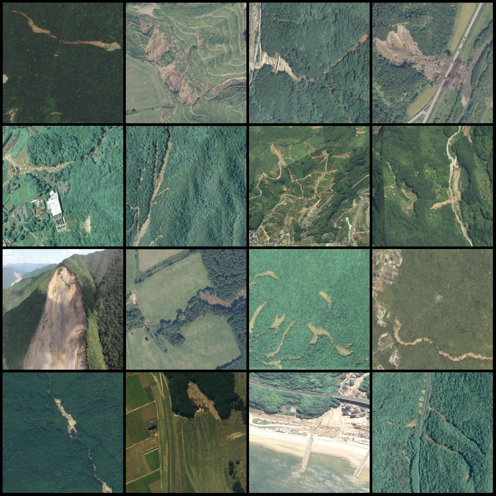
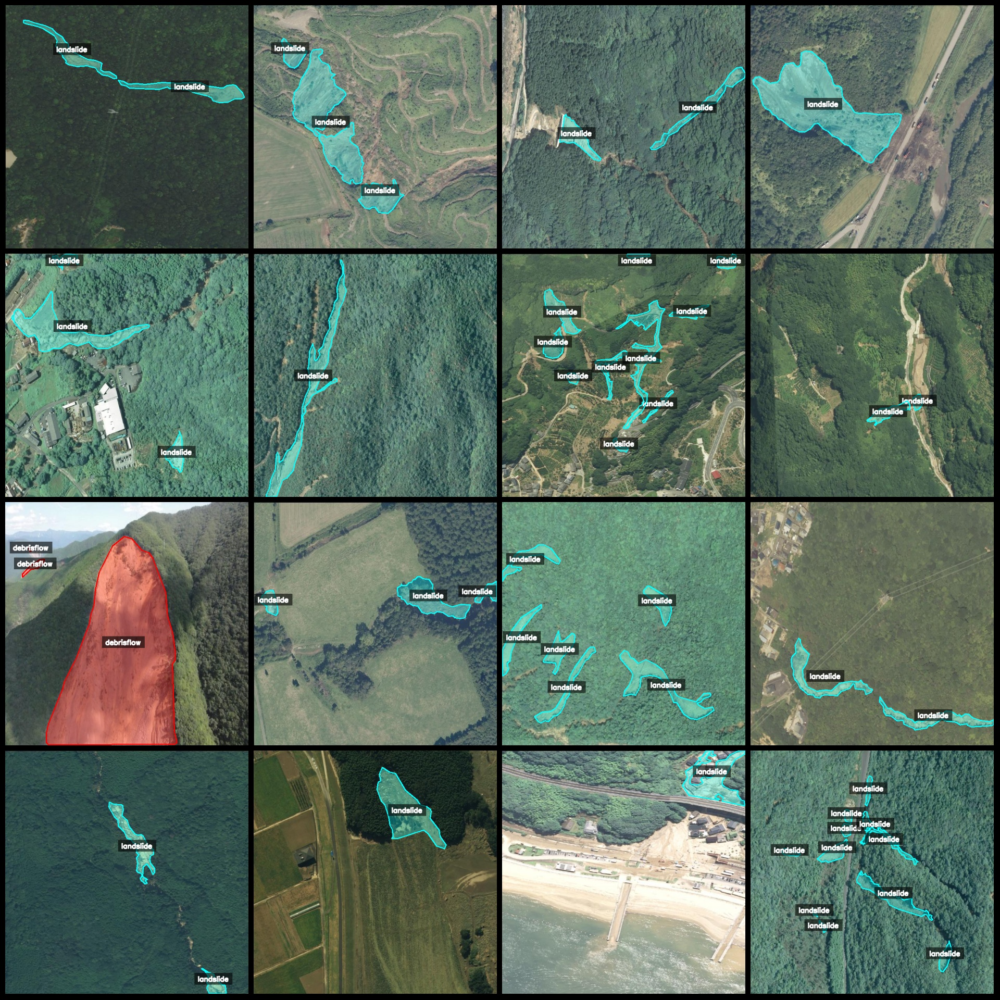
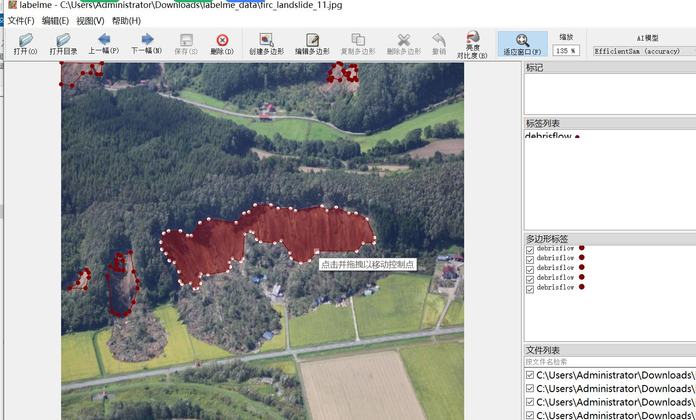

# Drone-Viewed Landslide and Debris Flow Separation Data Set in labelme Format with 2262 Images in 2 Categories

**Note:** One third of the images are original, while the remaining are enhanced images, primarily rotated.

**Dataset Format:** Labelme format (excluding mask files, only containing JPG images and corresponding JSON files)

**Number of Images (JPG File Count):** 2262
**Annotation Count (JSON File Count):** 2262
**Number of Annotations:** 2
**Annotation Categories:** ["debrisflow", "landslide"]
**Box Count for Each Category:**
- debris flow : count = 429
- landslide : count = 6079
**Total Boxes:** 6508

**Annotation Tool:** labelme v5.5.0
**Image Resolution:** 640x640
**Drone:** DJI MAVIC 3
**Collection Height:** 60-100m
**Collection Angle:** 60-90°
**Annotation Rules:** Polygon is drawn around each category.

**Important Notice:** The dataset can be opened and edited using labelme. For JSON datasets, they need to be converted into either Mask or Yolo or COCO format for semantic segmentation or instance segmentation.

**Special Disclaimer:** This dataset does not guarantee any accuracy in the training of models or weights.

**Preview of Images:**

**Example of Annotation:**
- **Original Image (Randomly selected 16 images):**
- **Annotation Drawing Results:**
- **Labelme Editing Image Example:**
## Picture

Here is a pay link on Stripe ( https://buy.stripe.com/3cs8yP7sY87d0vu9AB ). Please contact me lonlonago@foxmail.com after funding $89, and I will send you a complete data files , thank you!

